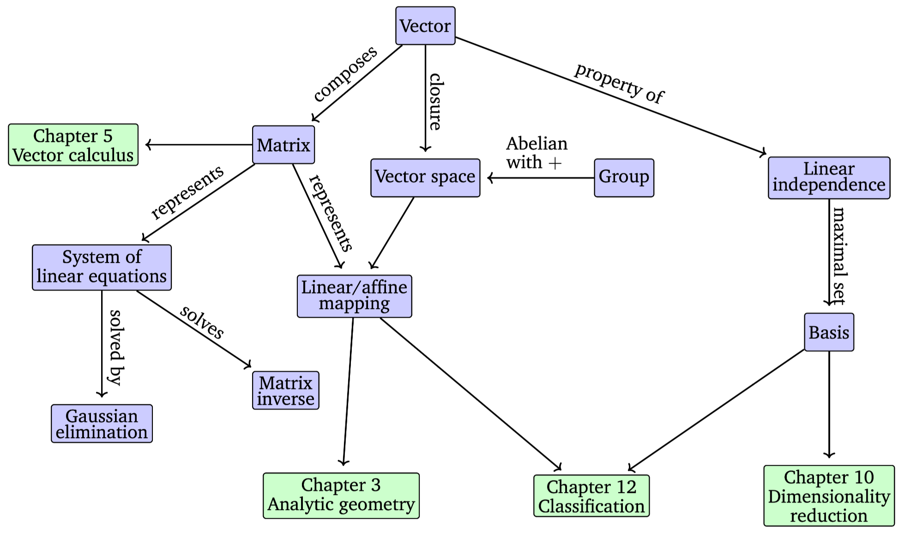

>Covering Chapter 1 Linear Algebra Section 2.1 Systems of Linear Equations and 2.2 Matrices

In general, vectors are special objects that can be added together or multiplied by scalars to procuce another obhject of the same kind. E.g., the geometric vectors, polynomials, audio signals (a seris of number), or tuples of $n$ real numbers $\mathbb{R}^n$.

**Vector space** is the set of vectors that can result by startinf with a small set of vectors, and adding them to each other and scaling them.

Figure 2.2 A mind map of the concepts introduced in this chapter, along with where they are used in other parts of the book.

## 2.1 Systems of Linear Equations

For a general *system of linear equations*:
$$
\begin{gathered}
a_{11}x_1+\cdot\cdot\cdot+a_{1n}x_n=b_1 \\
\vdots\\
a_{m1}x_1+\cdot\cdot\cdot+a_{mn}x_n=b_m
\end{gathered},\\
$$
where $a_{ij} \in \mathbb{R}$ and $b_i \in \mathbb{R}$.

To a compact notation of it, we collect the coefficients $a_{ij}$ into vectors, vectors into matrices, the system from the above is rewriten into:
$$
\begin{bmatrix}a_{11} \\ \vdots \\ a_{m1}\end{bmatrix}x_1+
\begin{bmatrix}a_{12} \\ \vdots \\ a_{m2}\end{bmatrix}x_2+\ldots+
\begin{bmatrix}a_{1n} \\ \vdots \\ a_{mn}\end{bmatrix}x_n=
\begin{bmatrix}b_{1} \\ \vdots \\ b_{n}\end{bmatrix} \\ \Longleftrightarrow
$$

$$
\begin{bmatrix}
	\begin{array}
	
	aa_{11}&  \ldots & a_{1n} \\
	\vdots & & \vdots\\
	a_{m1}& \ldots& a_{mn}
	
	\end{array}
\end{bmatrix} 
\begin{bmatrix}
x_1 \\ \vdots \\x_n
\end{bmatrix}=
\begin{bmatrix}b_{1} \\ \vdots \\ b_{n}\end{bmatrix}.
$$
In general, for a real-valued system of linear equations, we obtain either **no**, **exactly one**, or **infinitely many** solutions.

E.g., the solution space of a system of two linear equations with two variables can be geometrically interpreted as the intersection of two lines. Every linear equation represents a line:
## 2.2 Matrices

***Definition 2.1 (Matrix)***: 
For the matrix $\textbf{\textit{A}} \in \mathbb{R}^{m\times n} \mbox{~and~} m,n\in\mathbb{N}$, it is a $m\cdot n$-tuple of elements $a_{ij}$, which is ordered according to a rectangular scheme consisting of $m$ rows and $n$ columns:
$$A=\begin{bmatrix}
	\begin{array}
	
	aa_{11}& a_{12} & \ldots & a_{1n} \\
	a_{21}&a_{22} &\ldots & a_{2n}\\
	\vdots&\vdots& &\vdots\\
	a_{m1}&a_{m2}& \ldots& a_{mn}
	
	\end{array}
\end{bmatrix} 
,
a_{ij}\in\mathbb{R}.$$
(1,*n*)-matrices are called *rows* while (*m*,1)-matirces are *columns*. They are *row/column vectors*.

$\textbf{\textit{A}} \in \mathbb{R}^{m\times n}$ is equal to $\textbf{\textit{a}}\in \mathbb{R}^{mn}$, by stacking all *n* columns of  $\textbf{\textit{A}}$ into a long vector:

### 2.2.1 Matix Addition and Multiplication

The sum of two matrices $A\in \mathbb{R}^{m\times n}$ and $B\in\mathbb{R}^{n\times k}$,, is defined as the *element-wise sum*. For their product, $C=AB\in\mathbb{R}^{m\times k}$, the elements $c_{ij}$ are computed as:
$$c_{ij}=\sum^{n}_{l=1}a_{ij}b_{lj}, \mbox{~~~~~}i=1,\ldots,m,\mbox{~~~~}j=1,\ldots,k.$$
Which is to say, to compute element $c_{ij}, we multiply the elements of th *i*th row of *A* with the *j*th column of *B* element-wise, and sum them up.
NOTE: This is called ***dot product*** of the corresponding row and column, When explicitly anotating the multiplication is necessary, the notation $A\cdot B$ is used.  

**Matrices can only be multiplied if their "neighbouring" dimentions match**. E.g., $n\times k$-matrix ***A*** can multiply a $k\times m$-matrix ***B***, but order is fixed if $m\neq n$:
$$\underbrace{A}_{n\times k}\underbrace{B}_{k\times m}=\underbrace{C}_{n\times m}$$

Matrix multiplication is NOT element-wise operation, i.e., $c_{ij}\neq a_{ij}b_{ij}$. This kind of operation is often used in programming languages in multi-dimentional array multiplication, and is called ***Hadamard product***.

***Definition 2.2 (Identity Matrix)***:
An identity matrix is an $n\times n$-matrix containing 1 on the diagonal and 0 everywhere else. It's anotated as $I_n$.

Matrices have associativity and distributivity.
*Associativity*:
$$\forall A\in\mathbb{R}^{m\times n},B\in\mathbb{R}^{n\times p},C\in\mathbb{R}^{p\times q}:(AB)C=A(BC)$$
